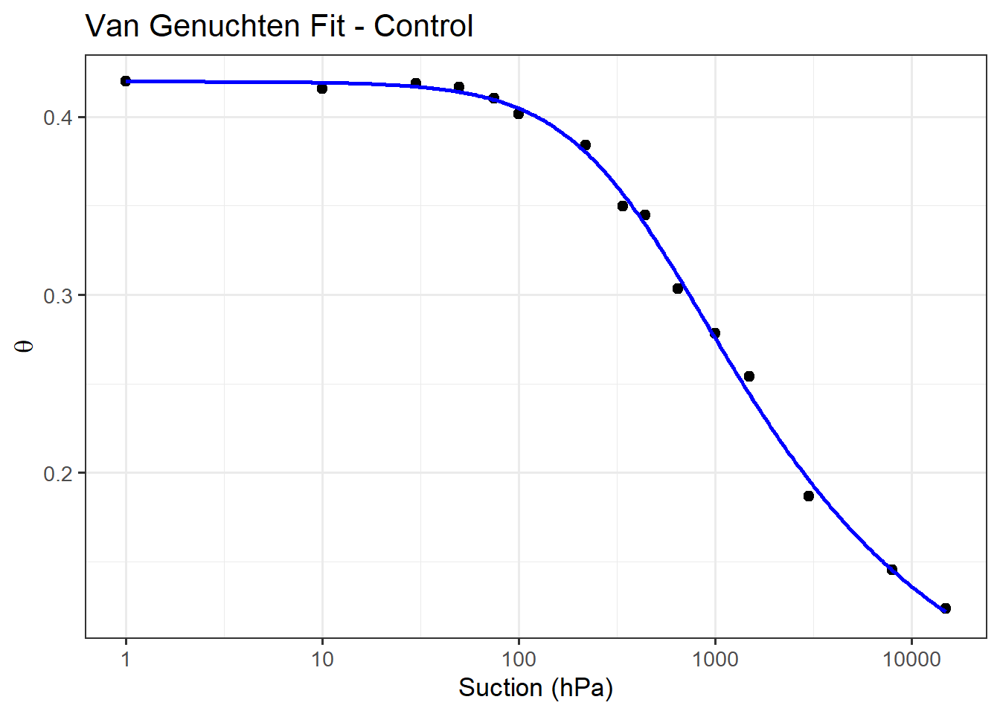

# **SoilHydro** — Van Genuchten Water Retention Curve Tools

**SoilHydro** is an R package for fitting **Van Genuchten** water
retention curves (WRC) and deriving hydrophysical metrics. It
standardizes suction units, fits per treatment/group, predicts
$\theta(h)$, computes water points (FC, PWP, AWC), partitions porosity
into macro/meso/micro classes, and plots results.

- 📦 **Dependencies**: `stats`, `ggplot2`
- 🧮 **Model**: Van Genuchten (Mualem form, m = 1 - 1/n)
- 🧭 **Units**: Accepts `kPa` or `hPa` for raw data; fitting is done in
  kPa internally
- 🧰 **Plotting**: One WRC plot per treatment; pore-size stacked bars
  (percent or volume)

------------------------------------------------------------------------

------------------------------------------------------------------------

## Installation

To install the package directly from GitHub, use:

``` r
# Install from GitHub using devtools
if (!requireNamespace("devtools", quietly = TRUE)) {
  install.packages("devtools")
}
devtools::install_github("egubens/SoilHydro")
```

> Requires R ≥ 3.6; packages: **stats** (base), **ggplot2**.

------------------------------------------------------------------------

## Quick start (with simulated data)

Below we **simulate realistic WRC data** for three treatments using the
Van Genuchten model, sample common suction points in **hPa**, add small
measurement noise, and then run the full workflow.

``` r
library(SoilHydro)
library(ggplot2)
```

    ## Warning: package 'ggplot2' was built under R version 4.3.3

``` r
set.seed(42)
```

``` r
# --------- 1) Define "true" VG parameters per treatment (kPa units) ---------
true_params <- list(
  Control     = list(theta_r = 0.05, theta_s = 0.42, alpha = 0.030, n = 1.42),
  ArtiMicro05 = list(theta_r = 0.02, theta_s = 0.44, alpha = 0.100, n = 1.55),
  Persist10   = list(theta_r = 0.04, theta_s = 0.46, alpha = 0.060, n = 1.50)
)

# --------- 2) Suction points (hPa) typical of lab WRC datasets ---------
hPa_grid <- c(1, 10, 30, 50, 75, 100, 220, 340, 440, 650, 1000, 1500, 3000, 8000, 15000)

# --------- 3) Generate data: θ(h) + noise; store as hPa for input ---------
sim_rows <- lapply(names(true_params), function(id){
  p  <- true_params[[id]]
  h_kPa <- hPa_grid / 10
  theta <- SoilHydro::vg_fun_kPa(h_kPa, p$theta_r, p$theta_s, p$alpha, p$n)
  theta_noisy <- pmin(p$theta_s, pmax(0, theta + rnorm(length(theta), sd = 0.006)))
  data.frame(Product = id, hPa = hPa_grid, theta = theta_noisy, stringsAsFactors = FALSE)
})
df <- do.call(rbind, sim_rows)

head(df)
```

    ##   Product hPa     theta
    ## 1 Control   1 0.4200000
    ## 2 Control  10 0.4158624
    ## 3 Control  30 0.4186704
    ## 4 Control  50 0.4167058
    ## 5 Control  75 0.4102049
    ## 6 Control 100 0.4016040

``` r
# --------- 4) Fit Van Genuchten per treatment (note: units = 'hPa') ---------
fits <- vg_fit_optim(
  data  = df,
  id    = "Product",
  theta = "theta",
  h     = "hPa",
  units = "hPa"
)
fits
```

    ##       Product .fit_ok     theta_r   theta_s      alpha        n         m
    ## 1 ArtiMicro05    TRUE 0.008167154 0.4355989 0.10356957 1.503640 0.3349473
    ## 2     Control    TRUE 0.047765797 0.4197565 0.02607172 1.439453 0.3052918
    ## 3   Persist10    TRUE 0.018931801 0.4644555 0.07194008 1.429538 0.3004731
    ##          R2        RMSE
    ## 1 0.9972856 0.007207470
    ## 2 0.9975671 0.004956925
    ## 3 0.9989176 0.004382912

``` r
# --------- 5) Plot WRC per treatment (log10 x-axis) ---------
plots <- plot_vg_fits(
  data      = df,
  params_df = fits,
  id        = "Product",
  theta     = "theta",
  h         = "hPa",
  units     = "hPa",
  log_x     = TRUE
)
plots[["Control"]]
```

<div class="figure" style="text-align: center">


<p class="caption">
Observed vs fitted WRC for one treatment (Control).
</p>

</div>

``` r
# --------- 6) Water points: FC at 10 kPa, PWP at 1500 kPa ---------
wp <- vg_water_points(fits, id_col = "Product", fc_kPa = 10, pwp_kPa = 1500)
wp
```

    ##       Product  theta_fc  theta_pwp       AWC
    ## 1 ArtiMicro05 0.3440217 0.04183028 0.3021914
    ## 2     Control 0.4047486 0.12191947 0.2828291
    ## 3   Persist10 0.4040153 0.07855736 0.3254580

``` r
# --------- 7) Pore-size classes (macro/meso/micro) + stacked bar plots ---------
psd <- vg_pore_classes(
  fits,
  id_col = "Product",
  percent_basis = "theta_s",           # % of total porosity (θs)
  include_residual_in_micro = TRUE     # include θr inside "micro"
)

g_pct <- plot_pore_classes_percent(psd, id_col = "Product")
g_vol <- plot_pore_classes_volume(psd,  id_col = "Product")
g_pct
```

<div class="figure" style="text-align: center">


<p class="caption">
Pore-size classes from VG fits.
</p>

</div>

``` r
g_vol
```

<div class="figure" style="text-align: center">


<p class="caption">
Pore-size classes from VG fits.
</p>

</div>

------------------------------------------------------------------------

## API overview

### Fitting & prediction

- `vg_fit_optim(data, id, theta, h, units)` — Fit VG parameters per
  group (or single fit if `id = NULL`).  
  **Returns**: ID, .fit_ok, theta_r, theta_s, alpha, n, m, R2, RMSE.

- `vg_predict(params_df, id_col, new_h, units)` — Predict θ at new
  suctions (kPa or hPa).  
  **Returns**: ID, h, units, theta.

- `vg_fun_kPa(h_kPa, theta_r, theta_s, alpha, n)` — Core VG function
  (kPa).

### Plotting

- `plot_vg_fits(data, params_df, id, theta, h, units, log_x = TRUE)` —
  Observed points + fitted VG curve.
- `plot_pore_classes_percent(psd_df, id_col, horiz = FALSE)` — Stacked
  **%** bars for macro/meso/micro.
- `plot_pore_classes_volume(psd_df, id_col, horiz = FALSE)` — Stacked
  **volume** bars (m³ m⁻³).

### Derived metrics

- `vg_water_points(params_df, id_col, fc_kPa = 10, pwp_kPa = 1500)` — θ
  at **FC** suction & PWP; **AWC** = θ_fc − θ_pwp.
- `vg_pore_classes(params_df, id_col, d_micro_um = 10, d_macro_um = 1000, percent_basis = c("theta_s","available"), include_residual_in_micro = TRUE, return_residual = FALSE)`
  — Macro/meso/micro volumes and percentages.

------------------------------------------------------------------------

## Unit handling

- Pass the **units of your raw suction column** to the fitter/plotter:
  `units = "kPa"` or `"hPa"`.
- Internally, the model uses **kPa**; fitted parameters come out with α
  in **kPa⁻¹**.
- Post-fit functions (`vg_water_points`, `vg_pore_classes`) assume
  parameters are in kPa (no `units` needed).

------------------------------------------------------------------------

## Citing the methods

- Van Genuchten, M. Th. (1980). A closed-form equation for predicting
  the hydraulic conductivity of unsaturated soils. *Soil Sci. Soc. Am.
  J.*, 44, 892–898.  
- Mualem, Y. (1976). A new model for predicting the hydraulic
  conductivity of unsaturated porous media. *Water Resour. Res.*, 12,
  513–522.

------------------------------------------------------------------------

## Contributing

Pull requests and issues are welcome! Please include:  
- a reproducible example,  
- R version and OS,  
- session info (`sessionInfo()`), and  
- if relevant, your data snippet (or a simulated equivalent).

------------------------------------------------------------------------

## License

MIT © Erick Gutierrez / Auburn University
